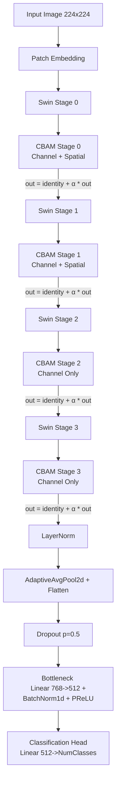
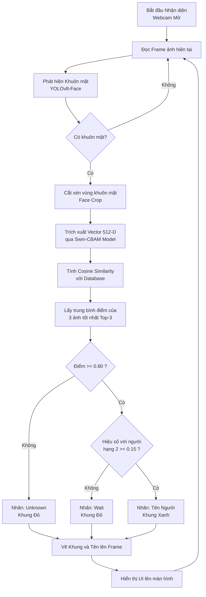

# Hệ Thống Nhận Diện Danh Tính Gương Mặt Có Khẩu Trang (Swin Transformer + CBAM)

Dự án này là một hệ thống nhận diện danh tính gương mặt, Sự dụng cho bài toán nhận diện có và không có khẩu trang. Hệ thống kết hợp sức mạnh của mô hình dò tìm khuôn mặt **YOLOv8-Face** để cắt vùng mặt với tốc độ và độ chính xác cao, cùng với kiến trúc phân loại tiên tiến **Swin Transformer** tích hợp cơ chế chú ý **CBAM (Convolutional Block Attention Module)** nhằm tối ưu hóa việc trích xuất đặc trưng vùng mắt/mặt.

---

## 1. Kiến trúc Mô hình (Swin Transformer + CBAM)

Mô hình sử dụng mạng backbone là **Swin Transformer (Tiny)**, được tinh chỉnh bằng cách chèn module **CBAM** vào sau mỗi Stage để tập trung vào các đặc trưng quan trọng (như vùng mắt khi đeo khẩu trang).

### Sơ đồ Kiến trúc

**Các đặc điểm kỹ thuật của kiến trúc:**
- **Zero Initialization (α):** Đầu ra của CBAM được nhân với một tham số `alpha` học được (khởi tạo bằng 0). Điều này giúp bảo vệ trọng số pre-trained của Swin ở những epoch đầu tiên.
- **Phân bổ CBAM:** Stage 0 & 1 sử dụng cả Spatial và Channel Attention để lọc nhiễu không gian và kênh. Stage 2 & 3 chỉ sử dụng Channel Attention để bảo vệ đặc trưng không gian sâu.
- **Bottleneck:** Một lớp nén đặc trưng  từ 768 chiều xuống 512 chiều, kết hợp BatchNorm và hàm kích hoạt PReLU.

---

## 2. Dataset và Tiền xử lý

Hệ thống được thiết kế để huấn luyện trên tập dữ liệu **RMFRD (Real-World Masked Face Recognition Dataset)**.
- **Mô tả:** Do sự mất cân bằng dữ liệu chủ yếu là không đeo khẩu trang tuy nhiên lại rất đa dạng về góc mặt, từ đó thực hiện với mỗi ảnh normal sẽ được gắn mask tạo ra ảnh mask mới để cân bằng dữ liệu.
- **Đặc điểm Dataset:** Chứa các hình ảnh của nhiều danh tính khác nhau. Mỗi người sẽ có cả ảnh đeo khẩu trang (Masked) và không đeo khẩu trang (Normal/Unmasked).
- **Phân chia dữ liệu (Data Split):** Tập dữ liệu được chia theo tỷ lệ **70% Train, 15% Val, 15% Test**. Việc phân chia được lập trình đảm bảo phân bổ đều cả ảnh có khẩu trang và không khẩu trang vào từng tập.

**Quá trình Tiền xử lý (Data Augmentation & Preprocessing):**
Để chống Overfitting và mô phỏng các điều kiện thực tế (như camera xê dịch, góc nhìn, điều kiện ánh sáng), các kỹ thuật augmentation sau được áp dụng cho tập Train:
1. `Resize((224, 224))`: Đưa ảnh về kích thước chuẩn của Swin.
2. `RandomHorizontalFlip(p=0.5)`: Lật ngang ảnh ngẫu nhiên.
3. `RandomRotation(15)`: Xoay ảnh tối đa 15 độ.
4. `RandomAffine(...)`: Phép biến đổi Affine mô phỏng việc khuôn mặt xa/gần hoặc lệch tỷ lệ.
5. `ColorJitter(...)`: Thay đổi độ sáng, độ tương phản, độ bão hòa màu và sắc độ.
6. `ToTensor()` & `Normalize(...)`: Chuẩn hóa ảnh theo chuẩn ImageNet.
7. `RandomErasing(p=0.2, scale=(0.02, 0.1))`: Xóa một mảng ngẫu nhiên trên ảnh (mô phỏng bị che khuất một phần mặt, ép mô hình học các phần khác).

---

## 3. Quá trình Huấn luyện và Các kỹ thuật áp dụng

Quá trình training được thiết lập với nhiều kỹ thuật Deep Learning nâng cao để ổn định sự hội tụ và tối đa hóa độ chính xác:

- **Differential Learning Rates (Tốc độ học đa cấp):** Không sử dụng chung một LR cho toàn mô hình.
  - `Backbone (Swin)`: LR rất nhỏ (5e-5) để không phá hỏng trí nhớ pre-trained.
  - `CBAM & Head/Bottleneck`: LR tiêu chuẩn (5e-4) để học nhanh đặc trưng mới.
  - `Alpha`: LR gấp đôi (1e-3) và không bị Weight Decay, giúp mô hình nhanh chóng quyết định có nên sử dụng CBAM hay không.
- **Loss Function:** `CrossEntropyLoss` đi kèm với:
  - `Class Weights` (cân bằng lớp) nhằm hạn chế mất cân bằng dữ liệu giữa các class.
  - `Label Smoothing = 0.2` giúp mô hình bớt tự tin thái quá, ngăn cản hiện tượng học vẹt (overfitting).
- **Dropout (0.5):** Cắt đứt 50% liên kết ngẫu nhiên tại tầng phân loại cuối cùng.
- **Optimizer & Scheduler:** `AdamW` với Weight Decay = 0.05. Lịch trình học sử dụng `CosineAnnealingLR` giúp giảm learning rate theo hình sin.
- **AMP (Automatic Mixed Precision):** Sử dụng `torch.amp.autocast` và `GradScaler` để huấn luyện bằng dấu phẩy động 16-bit (FP16), giúp tăng tốc độ train x1.5-x2 lần và giảm dung lượng VRAM.
- **Gradient Accumulation:** Tích lũy gradient trước khi update trọng số.
- **Early Stopping & Lưu Model tự động:** Dừng huấn luyện sớm nếu Validation Loss/Acc không cải thiện sau 10 epochs.

---

## 4. Quá trình quét Webcam và Nhận diện (Inference)

Khi chạy hệ thống ở chế độ nhận diện (Real-time WebCam), quá trình diễn ra với các lớp bảo vệ nghiêm ngặt để đảm bảo không nhận diện nhầm.

### Sơ đồ Luồng hoạt động của Webcam

**Mô tả chi tiết quá trình:**
1. **Phát hiện Khuôn mặt (Face Detection):** Webcam đọc frame và gọi hàm `detect_face`. Ở bước này, thay vì dùng HaarCascades cũ kỹ, hệ thống gọi trực tiếp mô hình **YOLOv8-Face** (`yolov8n-face.pt`). YOLOv8-Face là mạng neural chuyên dụng, cực kỳ nhẹ nhưng cho tốc độ siêu nhanh và độ chính xác vượt trội, bắt được khuôn mặt ngay cả khi góc nghiêng hoặc bị che khuất một phần bởi khẩu trang.
2. **Trích xuất (Embedding):** Vùng khuôn mặt được cắt ra và đưa qua mạng Swin-CBAM (chế độ `.eval()`) để chuyển đổi thành một vector 512 chiều.
3. **So khớp (Matching):** Tính toán **Cosine Similarity** giữa vector vừa trích xuất và toàn bộ cơ sở dữ liệu (từ file `embeddings.pkl`). Để giảm thiểu sai số của một tấm ảnh nhiễu trong DB, hệ thống áp dụng kỹ thuật **Top-3 Average** (Lấy trung bình 3 ảnh có điểm cao nhất của mỗi người).
4. **Bảo vệ bằng Ngưỡng đa lớp:**
   - **Absolute Threshold:** Người có điểm cao nhất phải vượt qua ngưỡng khắt khe (0.75 - 0.80). Dưới mức này sẽ gán mác `Unknown`.
   - **Margin Check:** Nếu vượt ngưỡng, hệ thống kiểm tra tiếp khoảng cách điểm số giữa người hạng nhất và hạng hai. Nếu khoảng cách dưới `0.15` (15%), chứng tỏ hệ thống đang phân vân giữa 2 người giống nhau -> Hiện cảnh báo `Wait` thay vì vội vàng nhận diện sai.
5. **Đăng ký (Enrollment):** Khi thu thập dữ liệu qua Webcam, hệ thống tích hợp `HeadPoseDetector` để ép buộc người dùng quay đủ 9 góc mặt khác nhau nhằm làm phong phú kho dữ liệu embedding.

## 5. Điểm hạn chế ở bài toán hiện tại
- **Dataset:** Tập dataset đối với ảnh đeo khẩu trang được tạo ra bằng cách chèn 1 khối minh họa việc đeo khẩu trang lên ảnh gốc. Điều này giúp mô hình có được lượng dữ liệu dồi dào, cân bằng và học được vùng mắt. Tuy nhiên nó lại ít biến động do chỉ là 1 khối màu dẫn đến cơ chế seft attention của swin đủ sức để phân loại và nhận dạng được ngay, nó không gặp nhiều khó khăn để phân biệt được đâu là vùng mắt và đâu là vùng bị che khuất. Dẫn đến khi train swin tranformer với dataset này sẽ khó thấy được sự khác biệt giữa mô hình góc và swin tranformer kết hợp CBAM.
- **Các góc mặt cực đoan:** Mặc dù đã có hệ thống `HeadPoseDetector` ép người dùng xoay đa góc khi đăng ký, nhưng trong thực tế nếu người dùng cố tình cúi gập mặt quá sâu hoặc quay đi khiến camera không thu được 2 mắt, mô hình vẫn sẽ không thể trích xuất đủ đặc trưng tin cậy để nhận diện.
